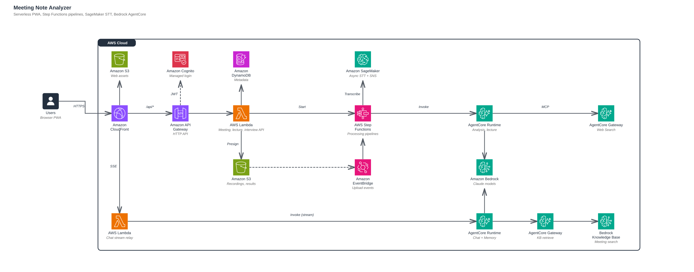

# Meeting Note Analyzer

Meeting Note Analyzer turns meeting recordings and lecture videos or audio into notes you can review and search. It runs in your AWS account, with a React web app, Cognito login, SageMaker transcription, and analysis on Amazon Bedrock AgentCore.

The app uses the CloudFront URL created during deployment, with HTTPS provided by CloudFront's default certificate. You do not need to register a domain, configure Route 53, provision your own certificate, or set up Google OAuth. Administrators create Cognito accounts; users sign in with their email address and password.

## Features

- **Meeting notes:** upload an MP3 to get a transcript, speaker labels, agenda, detailed notes, follow-up tasks, suggestions, and a mind map.
- **Speaker review:** contextual corrections are checked against transcript evidence. Uncertain changes keep the original speaker and are marked for review. Compare the original and corrected transcripts or play the supporting speech. See [speaker review](docs/speaker-review.md).
- **Meeting editing:** change a meeting title while analysis is running or after it finishes. Title and participant-name edits are coordinated with final document publication so concurrent saves preserve new results.
- **Short meeting brief:** a separate recap of the outcome, decisions and their reasoning, action items, and unresolved questions. Decision explanations include transcript evidence when available.
- **Lecture study:** select MP4 video or MP3 audio, optionally with a PPTX or PDF. The pipeline connects slides with spoken explanations, or organizes recordings without slides into topics. Notes include plain-language theory, mathematical notation, derivations, examples, and explicit source corrections or uncertainties.
- **Lecture PDF:** save all study sections, rendered formulas, questions and answers from the browser print dialog. Lecture access remains restricted to the owner; PDF export does not create a public page or include signed media download links.
- **Transcript downloads:** export the full selected transcript as UTF-8 TXT or Markdown with timestamps and speakers. Meetings offer original and speaker-corrected versions when available; lectures offer their original STT transcript.
- **Interview notes:** upload MP3 with an optional PDF resume. Select Technical Fit/Leadership Principles and L4–L7, then download questions, follow-ups, candidate answers, hints, and grounded rating drafts as Markdown. Resume gaps are linked to the relevant interview evidence; untested claims remain unrated.
- **Lecture recovery:** temporary model-service failures are retried automatically. A retried phase reuses cached scene and page analysis. See [retry behavior](docs/operations.md#lecture-retries).
- **Lecture playback:** a playing lecture docks into a small player when its original position scrolls out of view. Long meeting and lecture titles wrap within the page.
- **Paper search:** lecture references are retrieved through the AgentCore Web Search MCP connector and Gateway.
- **Chat:** ask questions about your meeting and lecture material with source references.
- **Background processing:** once the upload finishes and processing starts, analysis continues on the server after the browser closes. Keep the upload page open until then. Web Push notifications are optional.

The interface is in Korean. Meeting and lecture outputs can be requested in Korean, English, or the source language.

Expired sessions are renewed in the background when a refresh token is available. Drafts and playback remain in place during renewal, and expired audio links can be reconnected without losing the playback position. Recordings with no recognized speech stop before the analysis stages and show a clear error.

## Supported files

| Use | Required input | Optional attachment | Limits |
| --- | --- | --- | --- |
| Meeting | MP3 | None | 500 MiB, up to 4 hours |
| Lecture | MP4 or MP3 | PPTX or PDF | Video: 4 GiB, up to 4 hours and 4K. Audio: 500 MiB, up to 4 hours. Slides: 100 MiB, up to 120 pages. |
| Interview | MP3 | PDF resume | Audio: 500 MiB, up to 4 hours. Resume: 20 MiB, up to 20 pages. |

For lecture playback, use a browser-compatible MP4 encoding such as H.264/AAC. See [lecture study](docs/lecture-study.md) for screen matching and research limits.

## Architecture



| Component | Role |
| --- | --- |
| Users (Browser PWA) | Upload recordings, slides, and resumes. Read results and chat with meetings. |
| Amazon CloudFront | Single HTTPS entry point. Routes to web assets, `/api/*`, chat streaming, and presigned uploads. |
| Amazon S3 (Web assets) | Private bucket that stores the built PWA. |
| Amazon Cognito | Managed login. Issues the JWTs that API Gateway validates. |
| Amazon API Gateway | HTTP API with a JWT authorizer in front of the API Lambdas. |
| AWS Lambda (API) | Meeting, lecture, and interview APIs. Issues presigned URLs and starts or retries pipelines. |
| Amazon DynamoDB | Metadata and status for meetings, lectures, interviews, chat sessions, and push subscriptions. |
| Amazon S3 (Recordings, results) | Uploaded media plus transcripts, documents, and study results. |
| Amazon EventBridge | Emits completed-upload events that start the meeting pipeline. |
| AWS Step Functions | Meeting, lecture, and interview pipelines: transcribe, analyze, finalize. |
| Amazon SageMaker | Async speech-to-text endpoint. Completion goes back to the pipeline through SNS. |
| AgentCore Runtime (Analysis, lecture) | Containers that turn transcripts into meeting notes, lecture study guides, and interview reports. |
| AgentCore Gateway (Web Search) | MCP tool that lets the analysis agents search the web. |
| Amazon Bedrock | Claude models used by the analysis and chat runtimes. |
| AWS Lambda (Chat stream relay) | Checks the user token and streams chat answers back as server-sent events. |
| AgentCore Runtime (Chat + Memory) | Chat agent that keeps conversation memory. |
| AgentCore Gateway (KB retrieve) | IAM-only MCP tool that queries the knowledge base with a per-user owner filter. |
| Bedrock Knowledge Base | Indexes meeting and lecture markdown from S3 for search. |

Source: [`docs/architecture.svg`](docs/architecture.svg), generated from [`docs/architecture.json`](docs/architecture.json).

CDK defines separate stacks for storage, authentication, transcription, analysis, lectures, chat, orchestration, API, and web hosting. Local deployment settings and generated AWS identifiers are excluded from Git.

## Prerequisites

- Linux, macOS, or WSL2 with Bash.
- Node.js 22 or newer, Python 3.12 or newer available as `python3`, [uv](https://docs.astral.sh/uv/), and AWS CLI v2.
- Docker with Buildx and support for `linux/amd64` and `linux/arm64` builds.
- AWS credentials allowed to bootstrap CDK and create the resources in this project.
- Bedrock access to the configured Claude models and a SageMaker GPU endpoint quota of at least one instance.
- A Hugging Face read token and access to the transcription and diarization models.

Start with `us-east-1`. Check regional availability for AgentCore Web Search, managed knowledge bases, and the selected models before choosing another region. See [deployment prerequisites](docs/deployment.md#before-you-start) for the service and model requirements.

## Deploy

Deployment creates billable AWS resources, including GPU transcription capacity and model calls. Read the [deployment prerequisites](docs/deployment.md#before-you-start) before starting.

Review the [open dependency advisories](SECURITY.md#known-dependency-advisories) before deployment. Passing tests and secret scans does not resolve those dependency issues.

AWS CLI credentials are used for deployment and administration. They are separate from the Cognito accounts used to sign in to the app.

Choose an existing AWS CLI profile with deployment permissions. If it uses IAM Identity Center, sign in with `aws sso login --profile your-profile` first. For a new SSO profile, use `aws configure sso --profile your-profile`. Other AWS credential methods do not require SSO.

```bash
git clone https://github.com/mateon01/meeting-note-analyzer.git
cd meeting-note-analyzer
npm ci

# Replace your-profile with your configured AWS CLI profile.
export AWS_PROFILE=your-profile

npm run configure -- --email you@example.com
npm run doctor
npm run bootstrap
npm run secrets
npm run deploy
npm run user:create
```

`configure` writes `deploy.local.json`. `secrets` prompts for the Hugging Face token and generates VAPID keys in Secrets Manager. Passwords and tokens are not stored in the project configuration.

The first deployment prepares the STT models in CodeBuild and creates the application. A second CDK pass registers the generated CloudFront address with Cognito and updates the backend configuration. Both passes are handled by `npm run deploy`. CDK displays IAM permission changes for approval. Subsequent deployments reuse the models and saved site URL.

`user:create` prompts for a password and creates the first Cognito account. The deploy command prints the CloudFront address to open.

After deployment, run `npm run check:deployment`, then sign in and upload a short recording. `doctor` checks tools, AWS identity, and model profile discovery; it does not verify GPU quotas or run model inference. The [full deployment guide](docs/deployment.md#6-test-the-installation) covers the application checks.

## Common commands

| Command | Purpose |
| --- | --- |
| `npm run diff` | Review infrastructure changes |
| `npm run deploy` | Build and deploy the application |
| `npm run status` | Show current stack outputs |
| `npm run check:deployment` | Check web configuration and Cognito callback URLs |
| `npm run user:create -- --email teammate@example.com` | Create another login |
| `npm run user:password -- --email teammate@example.com` | Set an existing user's password |
| `npm run user:disable -- --email teammate@example.com` | Disable an account and revoke its Cognito sessions |
| `npm run user:enable -- --email teammate@example.com` | Re-enable an account |
| `npm run models:publish` | Republish STT weights; see [model updates](docs/operations.md#model-files-and-instance-changes) before redeploying |
| `npm run dev:config` | Prepare ignored configuration for local frontend development |

Use one checkout per AWS account, region, and installation. The deployment helper records that identity locally and rejects accidental switches. Resource names start with `meeting-analyzer` and stack names with `MeetingAnalyzer` by default; change both before the first deployment if needed.

## Development

Run these commands from the repository root after `npm ci`. The synthesis command uses an example account number for a template check only.

```bash
npm run typecheck
npm test
npm run test:deploy
npm -w web run build
CDK_DEFAULT_ACCOUNT=000000000000 CDK_DEFAULT_REGION=us-east-1 AWS_EC2_METADATA_DISABLED=true npm run synth

uv sync --project agents --frozen --extra dev
AWS_EC2_METADATA_DISABLED=true uv run --directory agents --extra dev pytest -q
uv sync --project lecture --frozen --extra dev
AWS_EC2_METADATA_DISABLED=true uv run --directory lecture --extra dev pytest -q --require-media
uv sync --project stt --frozen --extra dev
AWS_EC2_METADATA_DISABLED=true uv run --directory stt --extra dev pytest -q
```

Install FFmpeg, including `ffprobe`, to run the video tests and LibreOffice to run the PPTX conversion test. The lecture CI uses `--require-media`: missing media binaries, selecting no media tests, or skipping a media test fails the check. Local runs without this flag can skip video tests when tools are missing. The default STT development environment also skips the PyTorch-dependent diarization test.

For a local frontend connected to your deployed backend:

```bash
npm run dev:config
npm -w web run dev
```

Open `http://localhost:5173`. Vite proxies `/api` to the configured CloudFront endpoint. Cognito allows the localhost callback as well as the deployed application URL. Local development still uses your AWS backend and can incur model and transcription charges.

## Repository layout

| Directory | Contents |
| --- | --- |
| `web/` | React PWA |
| `infra/` | CDK stacks |
| `services/api/` | Authenticated application API |
| `services/pipeline/` | Workflow handlers and notifications |
| `agents/` | Meeting analysis and chat runtimes |
| `lecture/` | Video analysis and study material generation |
| `stt/` | SageMaker transcription container |
| `packages/` | Shared contracts and backend helpers |
| `scripts/` | Deployment, operations, model publishing, and source checks |

## Documentation

- [Deployment](docs/deployment.md): first installation and required access
- [Operations](docs/operations.md): updates, users, model changes, costs, and cleanup
- [Meeting briefs](docs/meeting-brief.md): concise summaries and decision evidence
- [Lecture study](docs/lecture-study.md): MP4/MP3 input, optional slides, PDF export, limits, and search
- [Interview notes](docs/interview-notes.md): optional resume context, Technical Fit/LP selection, target levels, evidence, and ratings
- [Security](SECURITY.md): authentication, data handling, and reporting
- [Dependency notes](docs/dependencies.md): external services, models, and build dependencies
- [Public release review](docs/public-release-review.md): removed deployment details, checks, and validation limits

## Before publishing a fork

Run `npm run check:public` and a [Gitleaks](https://github.com/gitleaks/gitleaks) scan. Keep `deploy.local.json`, `.deployment/`, CDK outputs, local credentials, recordings, and generated notes out of Git. The public CI workflow runs on GitHub-hosted runners and does not deploy to AWS.
